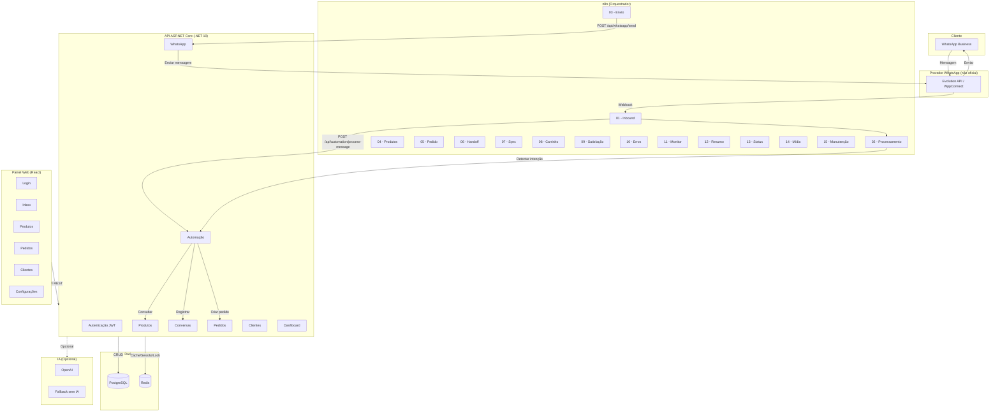
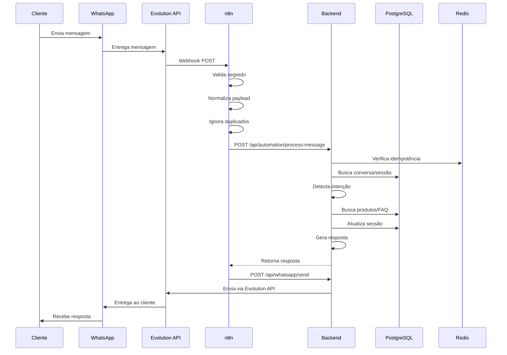
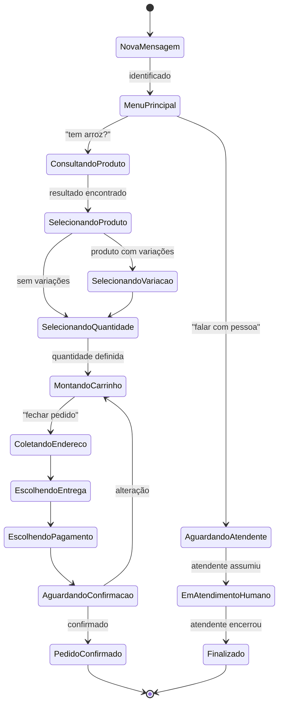

# Arquitetura do Sistema

## Diagrama de Arquitetura

```mermaid
graph TB
    subgraph Cliente
        WA[WhatsApp Business]
    end

    subgraph Provedor["Provedor WhatsApp (não oficial)"]
        EVOL[Evolution API / WppConnect]
    end

    subgraph n8n["n8n (Orquestrador)"]
        WF1[01 - Inbound]
        WF2[02 - Processamento]
        WF3[03 - Envio]
        WF4[04 - Produtos]
        WF5[05 - Pedido]
        WF6[06 - Handoff]
        WF7[07 - Sync]
        WF8[08 - Carrinho]
        WF9[09 - Satisfação]
        WF10[10 - Erros]
        WF11[11 - Monitor]
        WF12[12 - Resumo]
        WF13[13 - Status]
        WF14[14 - Mídia]
        WF15[15 - Manutenção]
    end

    subgraph Backend["API ASP.NET Core (.NET 10)"]
        AUTH[Autenticação JWT]
        PROD[Produtos]
        CONV[Conversas]
        ORD[Pedidos]
        CUST[Clientes]
        AUTO[Automação]
        DASH[Dashboard]
        WAS[WhatsApp]
    end

    subgraph Dados["Dados"]
        PG[(PostgreSQL)]
        RD[(Redis)]
    end

    subgraph IA["IA (Opcional)"]
        OAI[OpenAI]
        NULL[Fallback sem IA]
    end

    subgraph Frontend["Painel Web (React)"]
        LOGIN[Login]
        INBOX[Inbox]
        PRODS[Produtos]
        ORDS[Pedidos]
        CUSTS[Clientes]
        CFG[Configurações]
    end

    WA -->|Mensagem| EVOL
    EVOL -->|Webhook| WF1
    WF1 -->|POST /api/automation/process-message| AUTO
    WF1 --> WF2
    WF2 -->|Detectar intenção| AUTO
    AUTO -->|Consultar| PROD
    AUTO -->|Registrar| CONV
    AUTO -->|Criar pedido| ORD
    WF3 -->|POST /api/whatsapp/send| WAS
    WAS -->|Enviar mensagem| EVOL
    EVOL -->|Enviar| WA

    Backend -->|CRUD| PG
    Backend -->|Cache/Sessão/Lock| RD
    Backend -.->|Opcional| IA

    Frontend -->|API REST| Backend
```

## Fluxo de Mensagem

```mermaid
sequenceDiagram
    participant C as Cliente
    participant WA as WhatsApp
    participant EV as Evolution API
    participant N8N as n8n
    participant API as Backend
    participant DB as PostgreSQL
    participant REDIS as Redis

    C->>WA: Envia mensagem
    WA->>EV: Entrega mensagem
    EV->>N8N: Webhook POST
    N8N->>N8N: Valida segredo
    N8N->>N8N: Normaliza payload
    N8N->>N8N: Ignora duplicados
    N8N->>API: POST /api/automation/process-message
    API->>REDIS: Verifica idempotência
    API->>DB: Busca conversa/sessão
    API->>API: Detecta intenção
    API->>DB: Busca produtos/FAQ
    API->>DB: Atualiza sessão
    API->>API: Gera resposta
    API-->>N8N: Retorna resposta
    N8N->>API: POST /api/whatsapp/send
    API->>EV: Envia via Evolution API
    EV->>WA: Entrega ao cliente
    WA->>C: Recebe resposta
```

## Fluxo de Pedido

```mermaid
stateDiagram-v2
    [*] --> NovaMensagem
    NovaMensagem --> MenuPrincipal: identificado
    MenuPrincipal --> ConsultandoProduto: "tem arroz?"
    ConsultandoProduto --> SelecionandoProduto: resultado encontrado
    SelecionandoProduto --> SelecionandoVariacao: produto com variações
    SelecionandoProduto --> SelecionandoQuantidade: sem variações
    SelecionandoVariacao --> SelecionandoQuantidade
    SelecionandoQuantidade --> MontandoCarrinho: quantidade definida
    MontandoCarrinho --> ColetandoEndereco: "fechar pedido"
    ColetandoEndereco --> EscolhendoEntrega
    EscolhendoEntrega --> EscolhendoPagamento
    EscolhendoPagamento --> AguardandoConfirmacao
    AguardandoConfirmacao --> PedidoConfirmado: confirmado
    AguardandoConfirmacao --> MontandoCarrinho: alteração
    PedidoConfirmado --> [*]
    MenuPrincipal --> AguardandoAtendente: "falar com pessoa"
    AguardandoAtendente --> EmAtendimentoHumano: atendente assumiu
    EmAtendimentoHumano --> Finalizado: atendente encerrou
    Finalizado --> [*]
```
